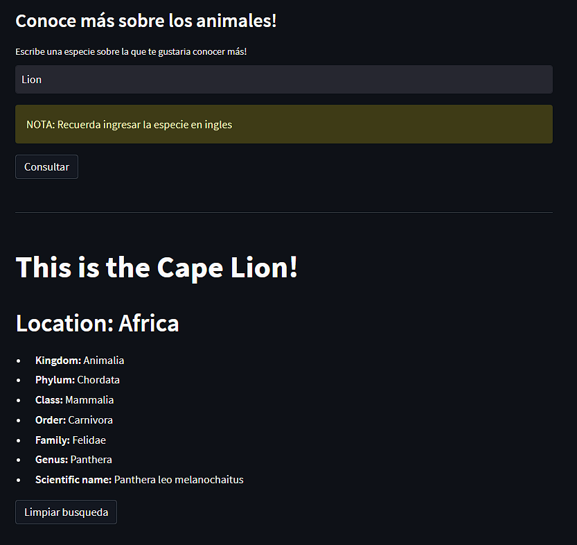

# GlizzyZoo 🐾
El GlizzyZoo es una herramienta interactiva que permite crear, gestionar y simular un zoológico virtual. Proporciona funcionalidades para agregar animales con sus atributos específicos, así como también para crear y administrar hábitats de diferentes tipos. Garantiza que el ingreso de los animales a los habitats sean coherentes y que los animales siempre se encuentren en un ambiente optimo para ellos. Por otro lado, GlizzyZoo permite tambien realizar la gestion de las dietas del zoologico permitiendo agregar y eliminar alimentos de cada una de las dietas dispuestas en el zoologico.

[-> Despliegue en la web](https://jpovalles-sistemazoopython-main-or38pe.streamlit.app/)

## Crear animal
Esta accion te permite agregar un animal al registro del zoologico, te consulta algunos parametros del animal como nombre, especie, estado de salud, el tipo de habitat, la dieta del animal, la temperatura optima, su edad y la cantidad de horas que necesita dormir al dia. Vale la pena recalcar que esta accion no se trata de agregar el animal a un zoologico sino meramente al registro del zoologico, es decir, como a un almacen. Al presionar el boton crear animal se crea un objeto de la clase animal y se guarda en una lista de animales de la clase Zoo. 

## Crear habitat
En esta seccion se permite crear y guardar habitats para albergar a los animales que se creen. Se piden dos tipos de parametros, estaticos y dinamicos, los primeros se tratan de los parametros que pueden ser registrados independientemente del tipo de habitat escogido como nombre del habitat, el mismo tipo de habitat, la capacidad del habitat o la dieta del mismo. Los segundos se tratan de parametros cuya consulta va a depender de lo ingresado en el tipo de habitat, como el rango de temperatura que varia su valor minimo y maximo segun esta seleccion, ademas se tienen dos atributos exclusivos para cada tipo de habitat cuyo valor se pide con el mismo principio. Los parametros dinamicos se clasifican asi:
* Desertico:  tipo de desierto, radiacion solar.             30°C - 40°C
* Selvatico:  porcentaje de humedad, nivel de precipitacion. 20°C - 35°C
* Polar:      porcentaje de hielo, grosor del hielo.        -10°C - 10°C
* Acuatico:   pH del agua, salinidad del agua.               0°C - 20°C

## Agregar animal al habitat
Esta accion permite en esencia asignar un habitat a un animal, funciona en base a los atributos del animal, pues clasifica todos los habitats registrados en el sistema de manera que muestre como opciones unicamente aquellos habitats propicios para el animal seleccionado. En caso de que no haya ningun habitat propicio para el animal se le notificara al usuario. Al presionar el boton el animal sera registrado dentro del diccionario de la clase habitat

## Listar habitats/animales
Esta funcion permite mostrarle al usuario todos los animales del *almacen* y todos los habitats registrados en el sistema, para cumplir con el objetivo los datos son desplegados en dos tablas. Se le informara al usuario en el caso que no haya registrado ningun animal en el almacen o cuando no haya habitats en el sistema.

## Listar animales por habitat
Lo que hace esta funcion es desplegar todos los animales contenidos en un habitat seleccionado del zoologico, esto lo hace en una tabla mostrando todos los atributos de cada animal registrado en el recinto de interes. Si el habitat esta vacio no permitira presionar el boton de listar y se le notificara al usuario que no puede hacer la consulta. En el caso contrario pues se desplegara toda la informacion de los animales.

## Ejecutar una accion
Este caso permite realizar una accion con cualquier animal, seleccionaod por su id, que este registrado en un habitat del zoologico. Las acciones disponibles son dormir, jugar y comer. Para la primera te pedira un numero de horas no mayor a las horas de sueño del animal de manera que el animal acumulara las horas de sueño que le ingreses hasta que iguales las horas necesarias para que descanse, cuando se igualen las horas no se permitira ingresar mas. Para comer se te daran todas las opciones dispuestas por la dieta del animal para que lo alimentes, por ejemplo, si el animal es carnivoro se te ofrecera cerdo, pavo y pollo para que lo alimentes. Por ultimo, jugar te permite recrear al animal pero no puedes hacerlo dos veces seguidas pues despues de jugar el animal se encontrara cansado.

## Eliminar comida
Simplemente te permite eliminar un alimento de la dieta seleccionada. Puedes eliminar cuantos alimentos quieras pero no se te permitira eliminarlos todos pues tiene que haber algun alimento disponible para alimentar a los animales.

## Agregar comida
Te permite agregar el alimento que se te ocurra a cualquiera de las dietas registradas en el zoologico. El registro de las dietas se hace por medio de diccionarios donde la clave corresponde al tipo de dieta (carnivoro, herbivoro, omnivoro) y el valor es una lista de los alimentos permitidos para el consumo de cada dieta. Esta dieta se almacena en la clase Zoo.

## Datos curiosos
Esta seccion te da la oportunidad de conocer mas sobre los animales que gustes, por lo que podras ingresar la especie sobre la que deseas conocer mas y se te mostraran los datos cientificos mas importantes sobre ese animal. Estos datos se consiguen por medio de una consulta API, por lo que tendras que ingresar la especie en idioma ingles puse esta API esta hecha en este lenguaje.

